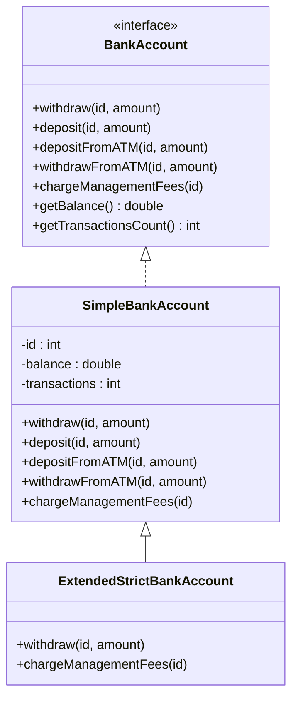

 # Improving an existing design with inheritance

Look at `SimpleBankAccount` and `StrictBankAccount`.

1. Create a new class `ExtendedStrictBankAccount` that extends `SimpleBankAccount`,
  with the same behavior of `StrictBankAccount` (provided by us).
  Your goal is to reduce, as much as possible, code duplications.
  *Note:* modifying `BankAccount`, `AccountHolder`, or `SimpleBankAccount` is *forbidden*.

2. Change the type of the class created in `TestBankAccount` and use it to test your implementation

3. Analyse what you just did: compare your `ExtendedStrictBankAccount` with `StrictBankAccount`. See how much code you *reused*.

4. Answer the following question: *How would you have designed the application, if you knew interfaces and and inheritance?*
    * Originally, we used inheritance in order to improve a sub-optimal design (of course it was sub-optimal, we didn't know inheritance existed!). 
    * Provide a simple UML scheme (draw it on paper or on [mermaid.live](https://mermaid.live/edit#pako:eNptkctOAzEMRX8l8gpE5weibhClEouuuqsiIU_iTqPJA_JQBWX-nUxgpNDilXVu7pXtXEB6RcBBGoxxo3EIaIVjpR6dtmjY-qvr2CbL8ZZudTzd0gP1Af9gzh60SwwHusb7FLQb2EBOUWjF2RJ3aEt7d38lWEy0wDp2He_yA-ZaYnvC8ckbHxopnrVdzBW8Z5TjQqY2dV6vSe3mHaL-pBe3JUqNINE9Y_o3ox6jHa333jAdX8_aqAaH7Bo_rMBSsKhV-ZnqFpBOZEkAL62iI2aTBAg3laeYk99_OAk8hUwryG-qXOj3L4Ef0USavgH6HZMp)) with your design proposal and let the teacher see it.
    * Draw the *vtable (virtual method table)* of the classes in your hierarchy.

## Proposed Solution (Steps 3 and 4)

### 3) Reuse analysis

`StrictBankAccount` duplicates many parts already present in `SimpleBankAccount`:
- common fields (`id`, `balance`, `transactions`)
- common operations (`deposit`, `depositFromATM`, `withdrawFromATM`, user check and transaction count handling)

With `ExtendedStrictBankAccount extends SimpleBankAccount` we reused almost everything and only specialized:
- `withdraw(...)`: deny withdrawals that would make the balance negative
- `chargeManagementFees(...)`: apply `MANAGEMENT_FEE + transactions * 0.1`, only if affordable, then reset transactions

So, instead of rewriting the whole class, we only override the strict behavior.

### 4) Better design with interfaces + inheritance

A simple design is:
- `BankAccount` as interface
- `SimpleBankAccount` as base implementation with shared logic
- `StrictBankAccount` extending `SimpleBankAccount` and overriding only stricter rules

This avoids duplication and keeps behaviors easy to compare.

#### UML (Mermaid)

#### Vtable (virtual methods)

`SimpleBankAccount` vtable (methods from `BankAccount`):
- `withdraw` -> `SimpleBankAccount.withdraw`
- `deposit` -> `SimpleBankAccount.deposit`
- `depositFromATM` -> `SimpleBankAccount.depositFromATM`
- `withdrawFromATM` -> `SimpleBankAccount.withdrawFromATM`
- `chargeManagementFees` -> `SimpleBankAccount.chargeManagementFees`
- `getBalance` -> `SimpleBankAccount.getBalance`
- `getTransactionsCount` -> `SimpleBankAccount.getTransactionsCount`

`ExtendedStrictBankAccount` vtable:
- `withdraw` -> `ExtendedStrictBankAccount.withdraw` (override)
- `deposit` -> inherited `SimpleBankAccount.deposit`
- `depositFromATM` -> inherited `SimpleBankAccount.depositFromATM`
- `withdrawFromATM` -> inherited `SimpleBankAccount.withdrawFromATM` (calls overridden `withdraw`)
- `chargeManagementFees` -> `ExtendedStrictBankAccount.chargeManagementFees` (override)
- `getBalance` -> inherited `SimpleBankAccount.getBalance`
- `getTransactionsCount` -> inherited `SimpleBankAccount.getTransactionsCount`
